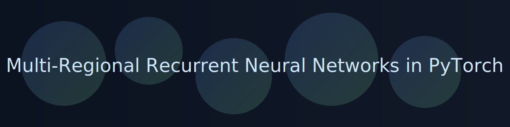

# mRNNTorch

Build, run, and analyze multi-regional recurrent neural networks in PyTorch — with tools for connectivity, Dale’s law constraints, and rich analysis utilities.

```{toctree}
:maxdepth: 2
:caption: Get Started

readme
```

```{toctree}
:maxdepth: 2
:caption: API Reference

api/index
```

```{admonition} Tip
:class: tip
Use the dark mode toggle in the sidebar to browse comfortably.
```

```{grid} 1 1 2 2
:gutter: 2

```{grid-item-card} Quick Start
:link: readme
:text-align: left

Install dependencies, configure regions and connections, and run your first mRNN.
```

```{grid-item-card} Explore the API
:link: api/index
:text-align: left

Dive into `mRNN`, `Region`, and `analysis` modules. Autodoc keeps it up to date.
```
```
